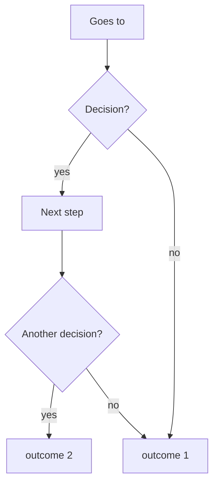

<!-- header: TITLE -->
<!-- _class: title -->

# TITLE

SUBTITLE
<script type="module">
  import mermaid from 'https://cdn.jsdelivr.net/npm/mermaid@10/dist/mermaid.esm.min.mjs';
  mermaid.initialize({ startOnLoad: true });
  await mermaid.run({
    querySelector: '.language-mermaid',
  });
</script>

---

<!-- header: Example > Overview -->

## What we'll cover
* Mermaid graph
* Columns
* Images
* Code blocks
* All together
* Exports

---

<!-- header: Example > Mermaid Graph -->

### Mermaid Graph



---

<!-- header: Example > Columns -->

### Two column layout

<div class=columns>
<div>

- You can put anything in this column

</div>
<div>

Any something else over here including images and graphs

</div>
</div>

---

### Three column layout

<div class=columns>
<div>

Now with

</div>
<div>

three 

</div>
<div>

columns 

</div>
</div>

---

<!-- header: Example > Images -->

# Images
* Usually width 400px is a good setting

Include in div
<div>
    
</div>

Include inline


---

<!-- header: Example > Code Blocks -->

#### Code Blocks
Python
```python
import math
def example():
    return math.sqrt(4)
```

Bash
```bash
echo "Hello world"
```

Javascript
```javascript
function example() {
    return 4;
}
```

---

<!-- header: Example > Together! -->

# All combined now!

<div class=columns>
<div>
    
</div>
<div>


</div>

---

<!-- header: Example > Exporting -->

# Export Slides
* The normal PDF export doesn't work great with divs and embedded mermaid
* Instead open the presentation as an HTML file in a browser and print to PDF
  ```
  marp --html presentation.md
  google-chrome-stable --headless --print-to-pdf="presentation.pdf" ./presentation.html
  ```
